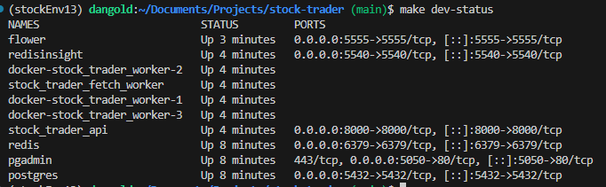
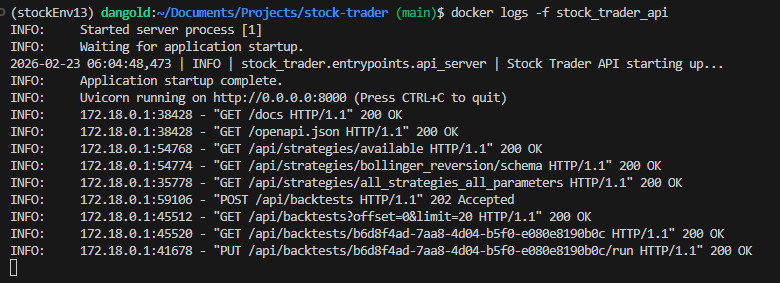
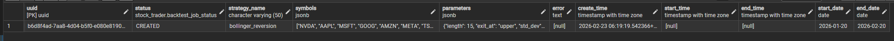
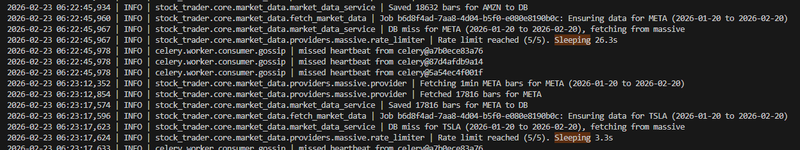
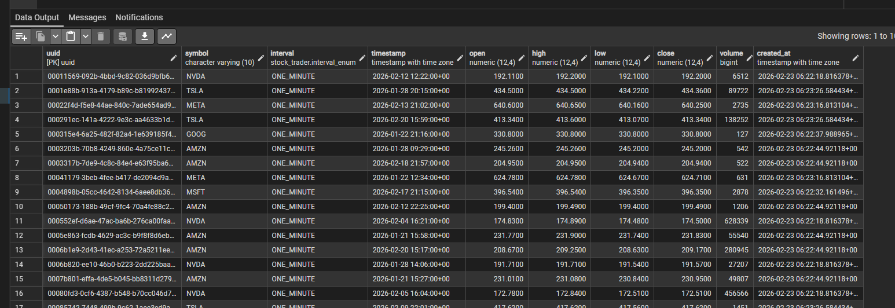
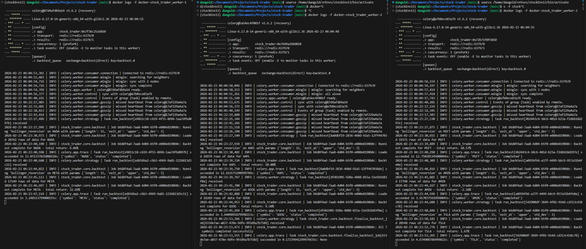
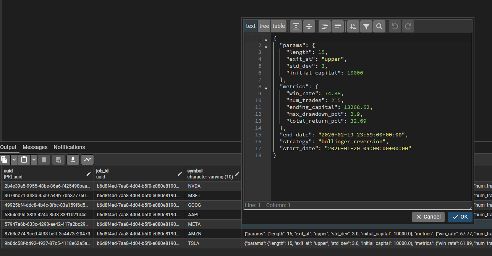

## Services Up and Running




## Example Create Backtest Arguments
```
{
  "strategy_name": "bollinger_reversion",
  "symbols": [
    "NVDA",
    "AAPL",
    "MSFT",
    "GOOG",
    "AMZN",
    "META",
    "TSLA"
  ],
  "parameters": {
    "length": 15,
    "std_dev": 3,
    "exit_at": "upper"
  },
  "start_date": "2026-01-20",
  "end_date": "2026-02-20"
}
```

## API Endpoints working



## Job Created in DB



## Fetch Rate Limited



## Market Data in DB



## Workers Working



## Backtest Results

