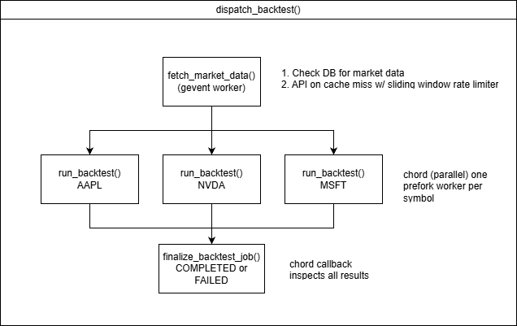
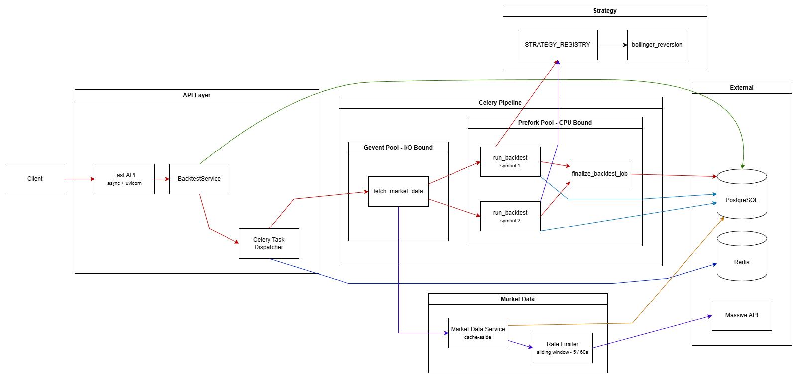

# Stock Trader Backtesting Platform

A production-style backtesting engine that evaluates trading strategies against historical market data. Built with FastAPI, Celery, PostgreSQL, and Redis, emphasizing clean architecture, testability, and a clear separation between the API layer, async task pipeline, and data access.

LinkedIn: https://www.linkedin.com/in/daniel-goldschmidt-a33525118/

---

## How It Works

A backtest follows a two-phase lifecycle: **create** then **dispatch**.

```
POST /api/backtests          ->  Job created (CREATED)
PUT  /api/backtests/{id}/run ->  Pipeline dispatched (RUNNING)
GET  /api/backtests/{id}     ->  Poll for results (COMPLETED / FAILED)
```

Once dispatched, the job enters a Celery pipeline:



We use two different workers here because market data fetching is I/O-bound (waiting on HTTP responses), a gevent pool handles this efficiently. And backtesting is CPU-bound (iterating price data, computing indicators), a prefork pool gives each task its own process with no GIL contention.

---

## Design Highlights

### Protocol-Based Dependency Injection

Every boundary in the system is defined as a `typing.Protocol`, not an abstract base class.

```python
class IBacktestRepoInterface(Protocol):
    async def create_backtest_job(self, ...) -> BacktestJobTableSchema: ...
    async def get_backtest_job(self, job_id: UUID) -> BacktestJobTableSchema: ...
    ...
```

This means tests use **in-memory fakes** (not mocks) that satisfy the same protocol, no patching, no `unittest.mock`, no coupling to implementation details:

```python
class MemoryBacktestRepository:
    """Satisfies IBacktestRepoInterface with a plain dict."""
    def __init__(self):
        self.jobs: dict[UUID, BacktestJobTableSchema] = {}

    async def create_backtest_job(self, ...) -> BacktestJobTableSchema: ...
```

### Strategy Registry with Pydantic Parameter Validation

Strategies register with both their implementation class and a Pydantic params model:

```python
STRATEGY_REGISTRY: dict[str, StrategyEntry] = {
    "bollinger_reversion": StrategyEntry(BollingerReversionStrategy, BollingerParams),
}
```

When a request comes in with `{"strategy_name": "bollinger_reversion", "parameters": {"length": 2}}`, validation happens at the API boundary, not deep inside a Celery worker:

```python
# BacktestCreateRequest model_validator
entry = STRATEGY_REGISTRY.get(self.strategy_name)
entry.params_model(**self.parameters)  # -> ValidationError: length >= 5
```


### Cache-Aside Market Data

Market data follows a DB-first pattern. The `MarketDataService` checks Postgres before hitting the external Massive (Polygon.io) API, backed by a sliding-window rate limiter for the free tier:

```
Request -> Check Postgres -> HIT -> Return OHLCVSeries
                         -> MISS -> Rate limit -> Fetch from API -> Bulk insert -> Return
```

---

## Tech Stack

| Layer | Technology |
|---|---|
| API | FastAPI + Pydantic v2 + uvicorn |
| Task Queue | Celery 5.6 with Redis broker/backend |
| Database | PostgreSQL 17 + SQLAlchemy 2.0 |
| Cache/Broker | Redis |
| Market Data | Massive API |
| Analysis | pandas + pandas-ta |
| Testing | pytest + pytest-asyncio + pytest-cov |
| Type Checking | mypy |
| Containers | Docker + Docker Compose |

---


## API

| Method | Endpoint | Description |
|---|---|---|
| `POST` | `/api/backtests` | Create a new backtest job |
| `GET` | `/api/backtests` | List jobs, filterable by status, paginated |
| `GET` | `/api/backtests/{id}` | Get job details and results |
| `PUT` | `/api/backtests/{id}/run` | Dispatch job to the Celery pipeline |
| `GET` | `/api/strategies/available` | List registered strategy names |
| `GET` | `/api/strategies/{name}/schema` | Full parameter schema with constraints |
| `GET` | `/api/strategies/all_strategies_all_parameters` | All strategies with their schemas |
| `GET` | `/api/debug/queue-length` | Backtest queue length from Redis |

---

## Running Locally

**Prerequisites:** Docker and Docker Compose.

```bash
# 1. Configure environment, edit docker/dev.env with your Massive API key
# All other defaults (DB credentials, Redis, Celery) work out of the box

# 2. Start everything (infra + API + workers)
make dev-up-all

# DB is at http://localhost:5050/
# API is at http://localhost:8000/api
# Redis is at http://localhost:5540
# Flower (Celery monitor) is at http://localhost:5555
```

### Useful Commands

```bash
make dev-up-all                 # Start all services
make stock-trader-mypy          # Type check
make dev-status                 # Container health
make dev-down                   # Tear down
```

---

## Testing

100+ unit tests, no database or network required.

```bash
make stock-trader-unit-test
make stock-trader-unit-test-coverage-html-report
```


---

## Adding a Strategy

1. Define a Pydantic params model with `extra="forbid"` and `Field` constraints
2. Implement `IStrategy`, just `name: str` and `run(df) -> BacktestResult`
3. Register in `STRATEGY_REGISTRY` as `StrategyEntry(strategy_cls, params_model)`

Parameters are validated at the API layer and the schema is auto-exposed via `GET /api/strategies/{name}/schema`.


## Architecture Diagram


